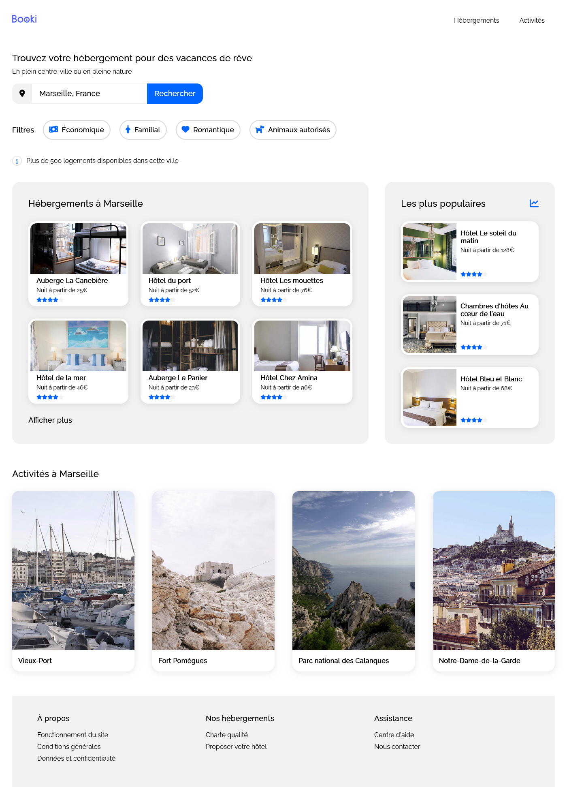

# Booki

Booki is a service for renting accommodation and activities. It was a starter project for us to become more familiar with HTML and CSS. We were given an intention in the form of an image and asked to translate it into the browser after breaking down the visual parts of the intention into HTML markup.

  

  

